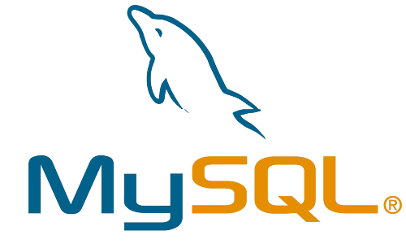

### Hiiiii 👋 i'am **Tejaswini Premkumar**
Just a girl who loves learning and is figuring stuff out on her own
## About Me 
A Sophomore at Sathiyabama Institute of Science and Technology - Chennai 
Persuing a Bachelor's Degree in Computer Science and Engineering.
- Courently exploring around Web-development
## Programing skills

 
 
 
 
 

 

### Stats

 
### Languages used

### Trophy

<!--
**Tejaswini-Premkumar/Tejaswini-Premkumar** is a ✨ _special_ ✨ repository because its `README.md` (this file) appears on your GitHub profile.

Here are some ideas to get you started:

- 🔭 I’m currently working on ...
- 🌱 I’m currently learning ...
- 👯 I’m looking to collaborate on ...
- 🤔 I’m looking for help with ...
- 💬 Ask me about ...
- 📫 How to reach me: ...
- 😄 Pronouns: ...
- ⚡ Fun fact: ...
-->
